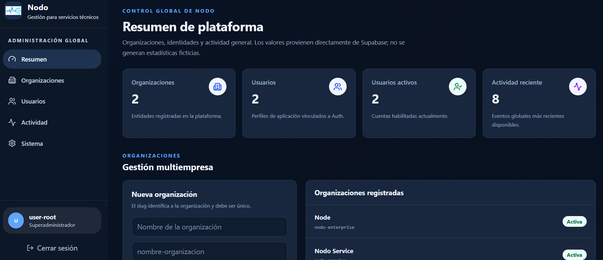
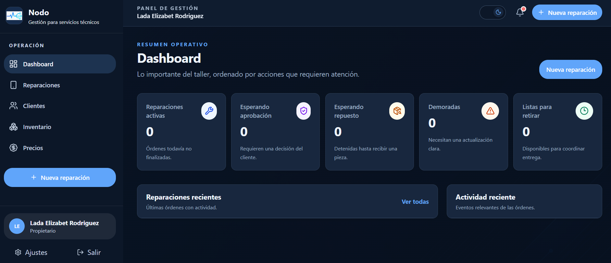
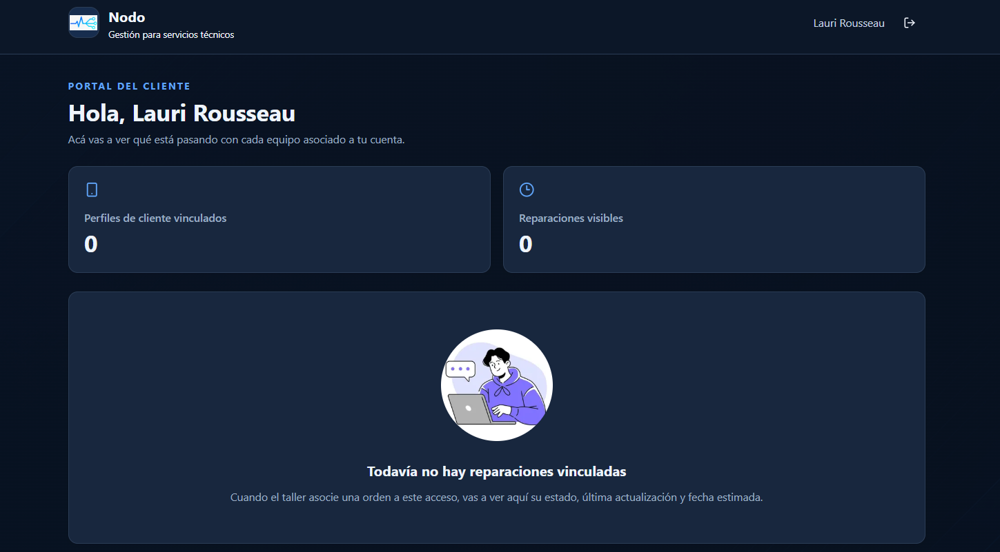

# Nodo

Plataforma web de gestión y seguimiento de reparaciones para **servicios técnicos**, diseñada para centralizar el ciclo completo de atención: desde la recepción de un equipo hasta su diagnóstico, presupuesto, reparación, cobro y entrega.

> **Estado:** 🚧 En desarrollo activo
>
> ## Screenshots

> Las siguientes capturas corresponden a una versión en desarrollo de Nodo. La interfaz, funcionalidades y datos mostrados pueden modificarse durante la evolución del proyecto.

### Dashboard — Superadministrador

Panel principal del superadministrador, orientado a la administración general de la plataforma y sus organizaciones.



### Dashboard — Administrador

Panel de administración de una organización, desde donde se gestionan las principales operaciones del servicio técnico.



### Dashboard — Cliente

Panel destinado al cliente final para consultar y realizar el seguimiento de sus equipos y servicios.



Nodo está planteado como una aplicación **multiusuario y multi-organización**, permitiendo que diferentes servicios técnicos administren sus operaciones de manera independiente dentro de una misma plataforma.

## Demo

🌐 [Ver aplicación desplegada](https://nodo-web-platform.vercel.app/)

> La instancia desplegada corresponde a una versión de desarrollo y demostración. Algunas funcionalidades pueden encontrarse todavía en implementación o modificación.

## Tecnologías principales

<p>
  
  
  
  
  
  
  
  
  
</p>

Actualmente el proyecto utiliza **Next.js 16**, **React 19**, **TypeScript**, Supabase y PostgreSQL como componentes principales de su arquitectura. También incorpora Zod para validación y Vitest para pruebas automatizadas.

## Objetivo

El objetivo de Nodo es reemplazar procesos dispersos o manuales de un servicio técnico por un flujo digital centralizado y trazable.

La aplicación busca contemplar tanto la operación interna del negocio como la experiencia del cliente, incluyendo estados, validaciones, responsabilidades y excepciones que aparecen durante una reparación real.

## Funcionalidades

### Organizaciones y usuarios

* Arquitectura multi-organización.
* Gestión de usuarios internos.
* Roles y permisos.
* Separación de datos entre organizaciones.
* Configuración inicial de cada espacio de trabajo.

### Clientes

* Registro y administración de clientes.
* Información de contacto.
* Asociación de múltiples dispositivos.
* Historial de servicios y reparaciones.

### Recepción de equipos

* Registro del dispositivo recibido.
* Identificación de características y estado inicial.
* Observaciones y condiciones de recepción.
* Seguimiento del equipo durante todo el servicio.

### Reparaciones

* Diagnóstico técnico.
* Presupuestos.
* Aprobación o rechazo de trabajos.
* Estados de reparación.
* Historial y trazabilidad.
* Registro de repuestos utilizados.
* Entrega final del equipo.

### Inventario

* Gestión de artículos y repuestos.
* Control de stock.
* Stock mínimo y niveles de disponibilidad.
* Seguimiento de repuestos asociados a reparaciones.

### Cobros

* Registro de pagos.
* Asociación de cobros a servicios.
* Control del proceso previo a la entrega.
* Historial de operaciones.

### Portal del cliente

* Seguimiento del estado de los equipos.
* Consulta de reparaciones.
* Información asociada a presupuestos y servicios.
* Acceso diferenciado respecto del personal interno.

### Seguridad

* Autenticación mediante Supabase.
* Gestión de sesiones.
* Roles y autorización.
* Validaciones tanto en cliente como en servidor.
* Políticas de seguridad para operaciones sensibles.
* Protección de credenciales y variables de entorno.

## Arquitectura

Nodo utiliza una arquitectura basada en **Next.js y React**, con TypeScript como lenguaje principal.

Supabase proporciona parte de la infraestructura backend, incluyendo autenticación y acceso a PostgreSQL.

```text
/
├── docs/
├── public/
│   └── images/
├── scripts/
├── src/
├── supabase/
│   └── migrations/
├── tests/
├── .env.example
├── next.config.ts
├── package.json
├── tsconfig.json
└── README.md
```

## Desarrollo local

Instalar las dependencias:

```bash
npm install
```

Crear el archivo de variables de entorno local tomando como referencia:

```text
.env.example
```

Iniciar el servidor de desarrollo:

```bash
npm run dev
```

Por defecto, Next.js estará disponible en:

```text
http://localhost:3000
```

## Comandos

| Comando         | Acción                           |
| --------------- | -------------------------------- |
| `npm run dev`   | Inicia el servidor de desarrollo |
| `npm run build` | Genera el build de producción    |
| `npm run start` | Ejecuta el build de producción   |
| `npm run lint`  | Ejecuta ESLint                   |
| `npm test`      | Ejecuta las pruebas con Vitest   |

## Screenshots

> Las siguientes capturas pertenecen a versiones en desarrollo de Nodo. La interfaz y las funcionalidades pueden cambiar durante la evolución del proyecto.

<!-- Agregar las capturas públicas aquí -->

<!-- Ejemplo:

### Dashboard


### Clientes


### Reparaciones


-->

## En desarrollo

Nodo continúa evolucionando. Entre las áreas que se encuentran en implementación o mejora se incluyen:

* ampliación de los flujos de reparación;
* gestión avanzada de inventario;
* experiencia del portal de clientes;
* automatización de estados y notificaciones;
* controles adicionales de seguridad;
* mejoras de experiencia de usuario;
* documentación y cobertura de pruebas.

## Consideraciones de seguridad

Las credenciales privadas y secretos de infraestructura **no deben incluirse en el repositorio**.

El archivo `.env.example` documenta únicamente las variables necesarias para configurar un entorno y no debe contener valores privados.

Archivos como `.env.local` y otras configuraciones locales deben permanecer fuera del control de versiones.

## Sobre el proyecto

Nodo es un proyecto en desarrollo orientado a explorar y resolver problemas reales de gestión en servicios técnicos.

El foco está puesto no solamente en implementar funcionalidades, sino en diseñar flujos consistentes, manejar situaciones excepcionales, mantener trazabilidad y construir una experiencia usable tanto para operadores como para clientes.

---

**Desarrollado por [Lada Rodriguez](https://github.com/ladardrgz)**
